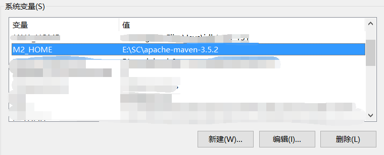
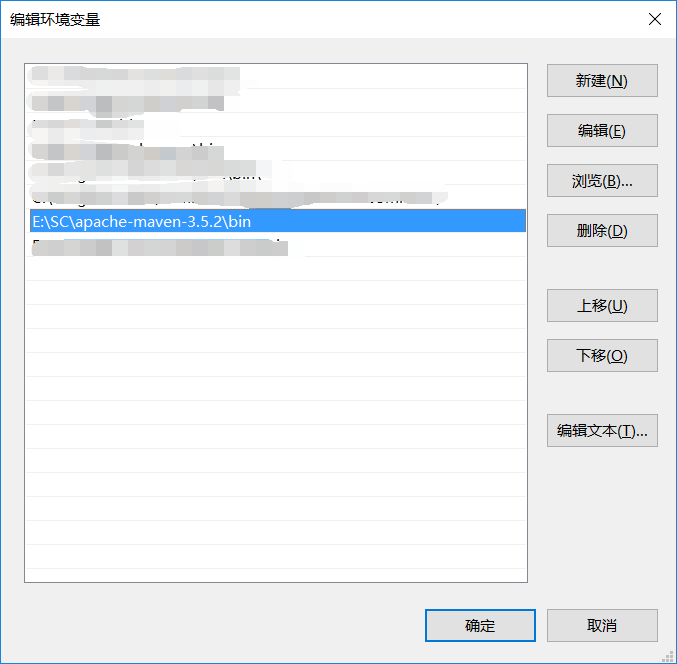
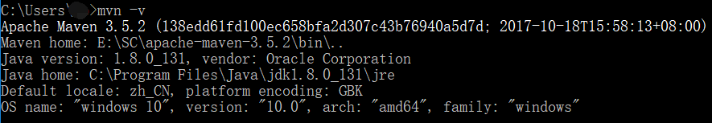
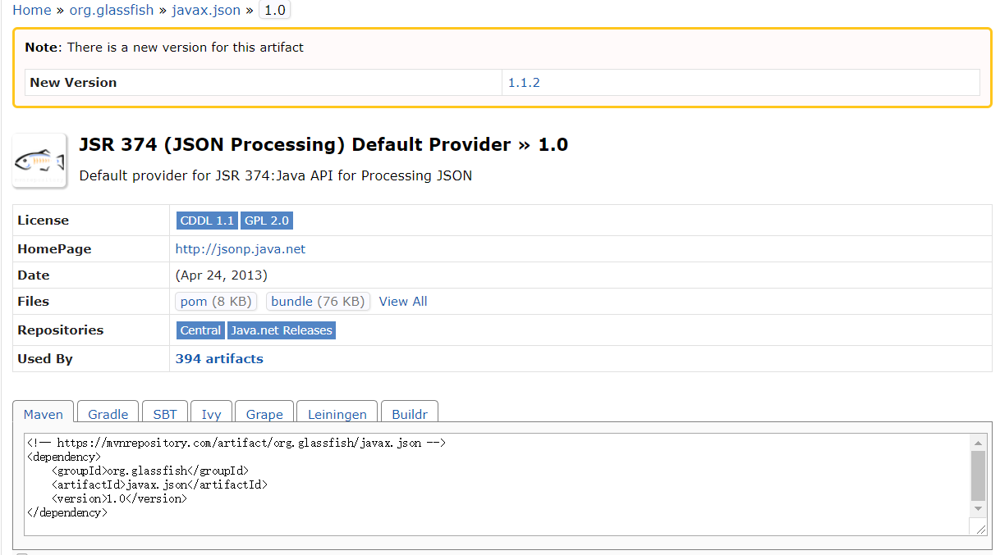
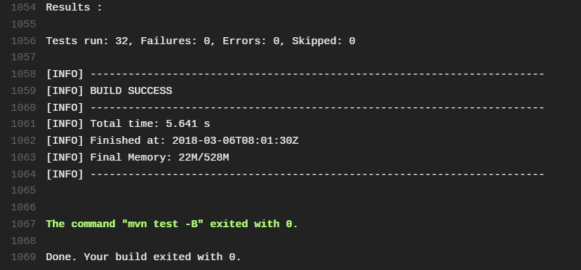

# 软件构造 Maven IDEA Blog-2

## 关于这次blog
写这次blog的目的，主要是希望可以看到这个blog的童鞋们可以实现针对HIT的软件构造课程，实现第1次试验的脱离`eclipse`的build，主要使用的工具`IDEA`（可选），`Travis-CI`， `Maven`。
## 什么是Maven
在软件构造的2-2节中，我们这样“狭义”地定义一下Build，即将三个维度之一的从Build time 到 Run time。借助自动化的工具完成软件构造各个阶段的活动，来提高效率。而Maven正是这其中的一项工具(tools)，除了Maven还有Ant，Gradle等等。这里承接上次Blog，在浅尝各个工具后，决定使用Maven进行专攻。

## 如何安装Maven
Maven安装其实很简单，主要有下面几个步骤（无论使用何种IDE，都不能跳过这个步骤）

1. 从官网下载[Maven](http://maven.apache.org/download.cgi)，然后解压到某个文件夹中。

1. 配置环境变量，这一点对于已经配置过Java环境变量的童鞋来说并不困难，此处以Win10系统为例。需要配置M2_HOME和PATH两个环境变量。


1. 验证配置是否成功，在命令行中输入"mvn -version"，如果正确配置则有Maven Home和Java的位置版本等信息出现。

4. 可以改变默认的仓库的位置，参见[菩提树下的杨过](https://www.cnblogs.com/yjmyzz/p/3495762.html)的相关教程。 

## 如何使用Maven
其实最简单的办法还是借用某一种IDE来使用Maven，这样编辑起来更方便而且更容易上手。这里使用IDEA来进行辅助工具来进行演示，但这不是必须的，使用命令行也完全可以实现所有必须的功能。
以下有三种方法，我们将分别进行解释。
1. 在已有的项目加上Maven的支持，这也是我一开始采用的办法，只需要在项目名称上右键，选择“Add Framework support"，就会有选项可以选择maven。然后就可以利用已生成的pom.xml自己添加所需要的支持。
2. 新建新的Maven项目，然后导入需要的源文件，这时IDEA使用Maven会默认使用Maven进行build，会看到Maven特有的编译成功的结果。
3. 直接利用命令行进行Maven项目的编译，这里不赘述一些基本过程，参见已有的blog[菩提树下的杨过](https://www.cnblogs.com/yjmyzz/p/3495762.html)的相关教程。 

## 一些“坑”
刚刚Maven自动生成的pom.xml都应该类似这样
```xml
<?xml version="1.0" encoding="UTF-8"?>
<project xmlns="http://maven.apache.org/POM/4.0.0" xmlns:xsi="http://www.w3.org/2001/XMLSchema-instance"
  xsi:schemaLocation="http://maven.apache.org/POM/4.0.0 http://maven.apache.org/xsd/maven-4.0.0.xsd">
  <modelVersion>4.0.0</modelVersion>

  <groupId>edu.hit</groupId>
  <artifactId>Lab1-1160300314</artifactId>
  <version>1.0-SNAPSHOT</version>
  <packaging>jar</packaging>

  <name>Lab1-1160300314</name>
  <url>http://maven.apache.org</url>

  <properties>
    <project.build.sourceEncoding>UTF-8</project.build.sourceEncoding>
  </properties>

  <dependencies>
    <dependency>
      <groupId>junit</groupId>
      <artifactId>junit</artifactId>
      <version>3.8.1</version>
      <scope>test</scope>
    </dependency>
  </dependencies>
</project>
```
**我们就针对这样一个pom.xml来讲解里面带的坑。**

 - 首先如果你在直接运行，就会提示找不到"org.junit.*"类。这是因为Junit导入的版本问题，不是我们需要使用的Junit4，而是更古老的版本Junit3.所以我们需要将这个依赖库改为：
```xml
<dependency>
      <groupId>junit</groupId>
      <artifactId>junit</artifactId>
      <version>4.12</version>
      <scope>test</scope>
    </dependency>
```
- 如果你在源文件中使用了类似`List<String> list = new Arraylist<>();`这样的语句，那么在build的时候还会看到所有这样的语句均会报错，这是由于Maven默认使用的是JDK1.5，不支持这样的语句。而使用低版本的JDK是因为在很多服务器上仍然使用的是JDK5或者更低的版本，所以为了支持这样的服务器，Maven默认使用JDK5。为了使用高版本的JDK，我们可以在`<dependencies>`再增加以下代码，就可以使用jdk1.8。
```xml
<build>
        <defaultGoal>compile</defaultGoal>
        <pluginManagement>
            <plugins>
                <plugin>
                    <groupId>org.apache.maven.plugins</groupId>
                    <artifactId>maven-compiler-plugin</artifactId>
                    <configuration>
                        <source>1.8</source>
                        <target>1.8</target>
                    </configuration>
                </plugin>
            </plugins>
        </pluginManagement>
    </build>
```
- 另外添加依赖库的办法，可以使用Maven的[仓库管理](http://mvnrepository.com/)，直接找到需要的jar包，然后在pom.xml增加即可，此处以增加`javax.json-1.0.jar`为例。

然后直接点击就可以粘在`<dependencies>`里即可
```xml
<!-- https://mvnrepository.com/artifact/org.glassfish/javax.json -->
<dependency>
    <groupId>org.glassfish</groupId>
    <artifactId>javax.json</artifactId>
    <version>1.0</version>
</dependency>
```
这样下来应该就可以使用了，**记得文件组织格式一定要严格遵守maven所给出的形式！**，build应该可以通过了（如果不能通过，见文章最后）。
再添加`.travis.yml`文件并将pom.xml和其一起push进仓库，再进入Travis-CI进行在线build。
```yml
language: java

jdk:
  - oraclejdk8
```
编译成功的截图如下图所示：


## 写在最后
如果刚刚还不能编译成功，我遇到的一种情况是因为我的编码格式出现了问题，我所有的源码都使用的UTF-8格式，在使用的时候会莫名无法解析，显示这个错误`Error: unmappable character for encoding UTF8 during maven compilation`，在Stack Overflow上面有一个[解答](https://stackoverflow.com/questions/8978013/error-unmappable-character-for-encoding-utf8-during-maven-compilation)，但是答案不能使用，需要改成`<encoding>Cp1252</encoding>`才能正常使用，不知道这里有什么问题，希望了解的童鞋给我私信。

另外对于学生，利用`edu.cn`结尾的邮箱真的有很大优惠，比如免费使用IDEA等jetbrain的全家桶，免费使用Travis-CI中对GitHub里面Private仓库的在线build，希望大家能够充分利用工具。
PS：获取Travis-CI的教育优惠可以利用[GitHub教育版](https://education.github.com/)去`get the pack`。