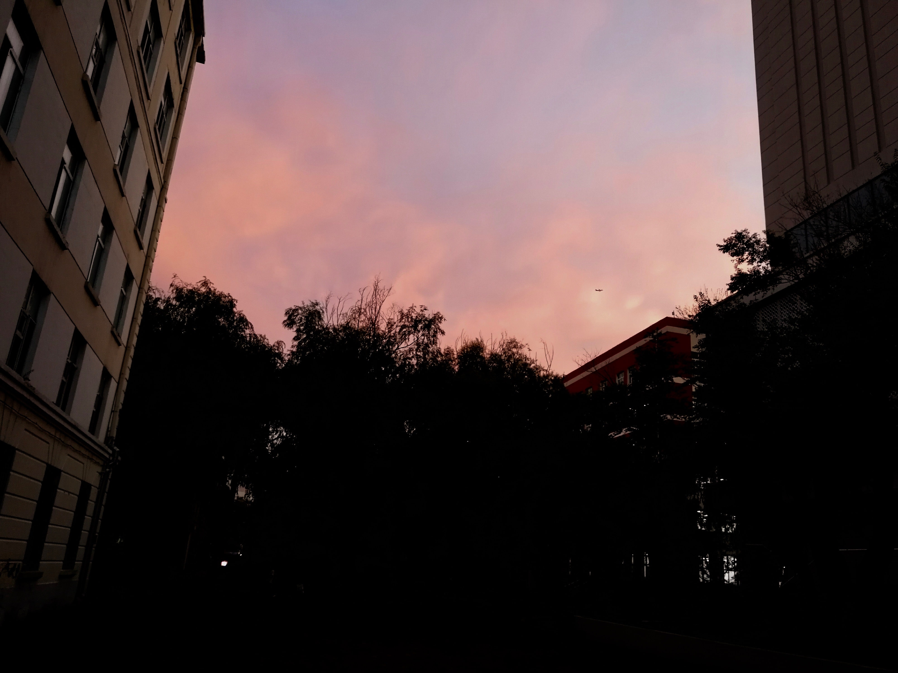

# 2019年年终总结

这是第二次写年终报告。

相比2018年，2019年确实显得有些不一样。这一年，从年初的准备保研，到年中确定，再到年尾来到深圳。这一年，
一个人去了很多城市，南京、上海、北京、深圳。这一年，经历了亲人的离世，对于家人的理解可能有多了一些。

在2019年的最后几天，其实就开始想写这篇blog了，当时想着一月份才写，那就等几天再说吧。今天，看到了苹果新出了2020年的新春短片，
《女儿》，感觉情绪有些波动，就想把过去一年的事情写出来。

其实，这一年很多时候我似乎都在逃避，在努力的同时也在给自己泄气，干了许多挺傻的事，比如在面试前一天，压力可能太大了吧，
跑去博物馆看了半天。很多的准备也没有做到位，似乎也没有达到自己心里最好的目标。

亲情，可能是这一年我的关键词。在暑假的时候抽着各种时间看完了《请回答1988》，对我触动最多的就是其中的亲情，
德善的爸爸在奶奶离世后，从表面上的毫无关系，到大哥回来后的崩溃；宝拉妈妈把她死命挡在身后；善宇妈妈在跟外婆电话里的痛哭。
我从没想过亲人的离开可以来的这么突然，从惯例打电话时我妈莫名的声音颤动和善意的谎言，到第二天中午知道真相，再到决定回家，
我直到那时候才知道这应该就是所谓我们一直所重视的亲情吧。

决定，2019年我做了可能是人生中的又一次重大决定，选择读博士，也就是决定了接下来几年的很有压力的博士生活，大概率是枯燥的、
孤独的，但我也希望**是丰富多彩的**。在临时回家的那段时间，家里人突然说到，“没想到你能坚持下来”，可能我也没想到吧，哈哈哈。

新的一年，2020年，希望做好过渡，22岁加油吧。
